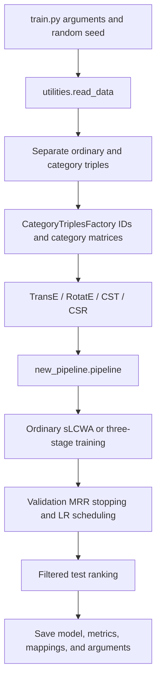

# Code guide

## 1. Purpose

This project performs knowledge-graph link prediction. Given `(head, relation, ?)` or `(?, relation, tail)`, it scores and ranks candidate entities. TransE uses a translation interaction; RotatE uses a complex rotation interaction. CST/CSR extend those interactions with category embeddings, a projection into entity space, and a learned preference for each entity's original representation.

The original repository contains 11 Python files. Most implementation complexity is concentrated in the 1,584-line custom training loop, which copies substantial PyKEEN training-control logic. Dependency versions must be pinned because private interfaces can change between PyKEEN releases.

## 2. Execution and data flow

Local datasets are read from `data/<dataset>/train_cate.txt`, `valid.txt`, and `test.txt`. The archive also contains `train.txt`, a copy of the ordinary training triples, but the entry point reads `train_cate.txt` and separates rows whose relation is `category`. Validation and test factories reuse training entity/relation IDs. Category labels are not ordinary candidate entities. PyKEEN may filter validation/test labels absent from the training mapping and emit warnings; check those warnings during reproduction.

Raw file line counts, before deduplication or mapping:

| Dataset directory | train.txt | train_cate.txt | valid.txt | test.txt |
| --- | ---: | ---: | ---: | ---: |
| yago_new | 32993 | 42745 | 4139 | 4092 |
| NELL-995_new | 138516 | 214008 | 7477 | 7061 |
| FB_new | 272115 | 366720 | 17526 | 20438 |
| DB_new | 681886 | 780226 | 18057 | 17694 |

## 3. Module responsibilities

| Module | Responsibility |
| --- | --- |
| `train.py` | Assemble loss, data, models, optimizers, schedulers, and stoppers; invoke the pipeline and save results |
| `utilities.py` | Separate category triples with `split_type_data()`; return training, validation, and test factories from `read_data()`; `get_key()` is not used by the main workflow |
| `category_triple_factory.py` | Build IDs, entity/category adjacency, head/tail relation/category matrices, reverse lookups, and relation mapping confidence; expose cross-view samples and binary persistence |
| `cs_model.py` | Implement category-supplemented scoring in `CategorySupplementedModel`; select interactions, dimensions, initialization, and constraints in `CST`/`CSR` |
| `category_training_loop.py` | Extend ordinary sLCWA with plateau scheduling; implement three optimizer stages, batching, callbacks, checkpoints, and exception handling |
| `cross_view_instances.py` | Produce pre-batched entity/category pairs through an IterableDataset |
| `cross_view_negative_sampler.py` | Replace entities or categories to generate negatives in `CorssViewNegativeSampler` (original spelling) |
| `cross_view_filter.py` | Filter known positive entity/category pairs with a Python set; mask=True identifies a valid negative |
| `training_callbacks.py` | Step the optimizer selected by the inner/cross_view/outer flag; schedule learning rates and save best states after validation |
| `stopper.py` | Delay validation under OneCycle; optionally evaluate and record training-set metrics |
| `new_pipeline.py` | Reuse private PyKEEN handlers, accept an already constructed training-loop instance, and return PipelineResult |

## 4. Category representations and scoring

Let E be the entity count, C the category count, d the entity dimension, and k the category dimension:

- Entity representations have shape E x d; category representations have shape C x k.
- The entity/category matrix A has shape E x C. Nonzero rows are L1-normalized, averaging an entity's assigned categories.
- The projection is `P = Linear(k, d) + Tanh`. The category-derived representation of entity e is `P(A[e] @ category_embeddings)`.
- Each entity has a trainable scalar w. `sigmoid(w)` determines the original entity-score contribution. Initially, categorized entities have w=0; uncategorized entities have w approximately 10.

`score_hrt()` uses only entity/relation representations. `score_hrt_with_cat()` separately substitutes the head and tail with category-derived representations, mixes scores using the corresponding weights, and averages the two directions. During evaluation, `score_t()` mixes category information only for the known head, while `score_h()` mixes it only for the known tail. Candidate entities retain their original representations. Stage-III training and inference therefore do not call the same scoring method.

`score_cross_view()` returns a negative norm over the entire batch divided by batch size: a scalar, **not a vector of per-example distances**. Its loss does not directly use the main model's NSSALoss. These are properties of the implementation; method names alone do not establish a standard contrastive objective.

CSR stores real-valued vectors that the PyKEEN interaction interprets as complex pairs, requiring even dimensions. Its `-ed` is therefore not directly comparable to the native RotatE complex `embedding_dim` in terms of parameter count.

## 5. Three stages within each epoch

Each epoch materializes the ordinary triple DataLoader as a list, then splits it by batch count using `inner_percentage`. This is not a validation-set split or an explicit second-order bilevel optimization procedure.

| Stage | Input and score | Updated parameters | Learning rate |
| --- | --- | --- | --- |
| I / inner | First approximately 80% of ordinary batches; `score_hrt`; NSSA or margin loss | Entity and relation embeddings | `-lr` |
| II / cross_view | All entity/category pairs; `score_cross_view`; custom logsigmoid loss | Category embeddings, projection, and entity embeddings | Categories/projection: `-lr_beta`; entities: `-lr_kappa` |
| III / outer | Remaining ordinary batches; `score_hrt_with_cat`; NSSA or margin loss | Per-entity preference weights | `-lr_eta` |

Both stages I and III use `-nen` negatives; stage II uses `-nenT`. In stage III, only the outer optimizer updates preference weights. Participating in the forward pass does not imply that every parameter is updated.

Stage II applies logsigmoid to positive scores and averages logsigmoid-transformed negative scores. It then weights the negative term with a detached `s-s^2`. This is not the standard self-adversarial softmax objective and should be checked against the intended method before claiming reproduction. Epoch loss averages batch losses from all three stages and should not be compared directly with ordinary TransE loss.

Baseline models use the other loop and train only on ordinary triples. Default stopping evaluates validation MRR every 10 epochs with patience of 10 evaluations. RLRP uses the stopper's best recorded metric rather than per-batch loss.

## 6. Corrections made during setup

- Replaced mandatory CUDA with auto/cpu/cuda selection; set the memory fraction only on CUDA and move models to the selected device before optimizer construction.
- Replaced an undefined `training` reference for built-in datasets with `dataset.training`.
- Create RLRP scheduling from an EarlyStopper only, avoiding access to nonexistent patience fields when stopping is disabled.
- Restore stage-III negative scores to batch-by-negatives shape before loss evaluation, avoiding incorrect broadcasting or reduction.
- Preserve the complete `ent2cat` mapping instead of overwriting it with the last entity.
- Import BoolTensor/LongTensor from torch for PyKEEN compatibility.
- Pass the requested `-o` optimizer to the baseline loop.
- Locate data, default outputs, and caches relative to the project; save actual arguments in `args.json`; set the seed before constructing models.
- Correct the `.item()` typo in `get_key()` and the documented dataset return order.

## 7. Algorithm-review concerns

The following concerns come from static inspection. The setup work did not redesign these algorithms:

1. `create_entity_mapping()` retains only an intersection in its branch for many categorized entities, potentially dropping ordinary entities without categories. With externally supplied entity IDs, `categorized_ent_num` is also not computed correctly. Additional datasets require explicit validation.
2. `CategoryTriplesFactory._from_path_binary()` does not restore every required constructor field. Successful saving does not establish factory round-trip support. Smoke tests check training, evaluation, and model-file creation, not independent factory deserialization.
3. CSR's real-to-complex interpretation produces many PyKEEN warnings. Any dedicated complex representation needs a dimension-semantics review rather than a dtype-only change.
4. `score_h/score_t` explicitly repeat candidate tensors, increasing memory consumption. Candidate subsets remain unsafe because reshaping still uses `num_entities` even when heads/tails are supplied.
5. The cross-view sampler partitions corruption ranges using the categorized-entity/category ratio. Boundary cases, including more categories than entities, need coverage checks. Multi-worker sample partitioning also has an offset issue; the entry point currently defaults to zero workers.
6. Materializing `list(batches)` retains a full epoch of ordinary negatives, which may consume substantial memory at large negative-sampling counts.
7. OCLR is attached to the base optimizer, while category models update parameters through three other optimizers. It is not established that OCLR schedules those active optimizers. Existing category presets use RLRP.
8. The original `-r/-rn` configuration creates a tuple, and the model is constructed before pipeline regularization can reliably apply. `-train` is replaced by an explicit loop later. `-ef` uses argparse's bool conversion, so the string False evaluates to true. These nondefault options need separate corrections and validation.
9. Bare except handlers in optimizer callbacks report arbitrary optimizer errors as missing flags. Full continuation of all three optimizers and the best-checkpoint lifecycle have not been verified.
10. Relation/category matrices, relation confidence, and `normal_noise` are computed or stored but are not consumed by the main scoring/training path. Their presence does not mean the current algorithm uses all relation/category information.

Suggested reading order: `train.py`, `utilities.py`, the factory's `from_labeled_triples`, `cs_model.py`, `_train_epoch`, the three loss handlers and callbacks, then pipeline/stopping/persistence. Establish actual parameter flow and update ownership before comparing with a paper or changing the loss.
