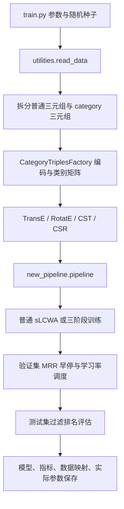

# 代码导读

## 1. 项目做什么

任务是知识图谱链接预测：给定 `(头实体, 关系, ?)` 或 `(?, 关系, 尾实体)`，给所有候选实体打分并排名。TransE 使用平移交互，RotatE 使用复数旋转交互。CST/CSR 在这些交互之上引入实体所属类别，学习类别表示、到实体空间的投影，以及每个实体对原始表示的偏好权重。

仓库共有 11 个原始 Python 文件，主要复杂度集中在 1584 行的自定义训练循环。它复制了大量 PyKEEN 内部训练控制逻辑，因此依赖版本必须固定；只升级 PyKEEN 很容易破坏私有接口。

## 2. 执行与数据流

本地读取 `data/<dataset>/train_cate.txt`、`valid.txt`、`test.txt`。`train.txt` 是数据包中的普通训练三元组副本，入口实际读的是 `train_cate.txt`，从中分离关系名为 `category` 的记录。验证和测试复用训练实体/关系 ID，不把类别标签当作普通候选实体。PyKEEN 对训练映射中未出现的验证/测试标签可能过滤并报警，复现实验时须检查日志。

原始文件行数（非去重后张量数量）：

| 数据集目录 | train.txt | train_cate.txt | valid.txt | test.txt |
| --- | ---: | ---: | ---: | ---: |
| yago_new | 32993 | 42745 | 4139 | 4092 |
| NELL-995_new | 138516 | 214008 | 7477 | 7061 |
| FB_new | 272115 | 366720 | 17526 | 20438 |
| DB_new | 681886 | 780226 | 18057 | 17694 |

## 3. 每个模块负责什么

| 模块 | 主要职责 |
| --- | --- |
| `train.py` | 构造 loss、数据、模型、优化器、调度器与早停器；调用 pipeline 并保存 |
| `utilities.py` | `split_type_data()` 拆分类别，`read_data()` 返回训练、验证、测试工厂；`get_key()` 为未被主流程调用的工具 |
| `category_triple_factory.py` | 构造 ID、实体类别邻接矩阵、头尾方向的关系类别矩阵、类别实体反查、关系映射置信度；提供跨视图样本与二进制保存方法 |
| `cs_model.py` | `CategorySupplementedModel` 实现类别增强打分；`CST` 和 `CSR` 指定交互、维度、初始化与约束 |
| `category_training_loop.py` | 普通 sLCWA 的平台期降学习率扩展；类别模型的三个优化阶段；批次、回调、检查点与异常处理 |
| `cross_view_instances.py` | 从实体类别对生成预分批 IterableDataset |
| `cross_view_negative_sampler.py` | `CorssViewNegativeSampler`（原拼写）替换实体或类别产生负例 |
| `cross_view_filter.py` | Python 集合过滤已知实体类别正例，mask=True 表示可用负例 |
| `training_callbacks.py` | 按 inner/cross_view/outer 标记更新对应优化器；验证后调度学习率和保存最佳状态 |
| `stopper.py` | OneCycle 下延迟验证；可选额外评估训练集并记录结果 |
| `new_pipeline.py` | 复用 PyKEEN 的私有处理函数，允许直接传入已构建训练循环实例，返回 PipelineResult |

## 4. 类别增强模型的关键张量与打分

设实体数为 E、类别数为 C、实体维度 d、类别维度 k：

- 实体表示形状为 E×d，类别表示为 C×k。
- 实体类别矩阵 A 为 E×C，非零行做 L1 归一化，等价于对所属类别取均值。
- 投影 `P = Linear(k, d) + Tanh`，实体 e 的类别代理表示为 `P(A[e] @ category_embeddings)`。
- 每实体一个可训练参数 w；`sigmoid(w)` 决定原始实体打分的占比。初始化时有类别实体 w=0，无类别实体 w≈10。

`score_hrt()` 只用实体/关系表示。`score_hrt_with_cat()` 分别替换头实体与尾实体为类别代理，按各自权重混合，再取两方向平均。评估 `score_t()` 只混合已知头实体的类别，`score_h()` 只混合已知尾实体的类别，候选实体仍使用原始表示。因此训练第三阶段和推理并非调用同一个打分方法。

`score_cross_view()` 返回整个批次的负范数除以批次大小，是一个标量，**不是逐样本距离向量**。跨视图损失也没有直接使用主模型的 NSSALoss，详见下一节。这些都是现有实现行为，不能仅凭方法名推断为标准对比损失。

CSR 的向量以实数存储，由 PyKEEN 交互视为复数配对，要求相关维度为偶数；因此 CSR 的 `-ed` 与 PyKEEN 原生 RotatE 的复数 embedding_dim 不宜直接按参数量等同。

## 5. 三阶段训练：一个 epoch 内实际发生什么

每轮先把普通三元组 DataLoader 转成列表，再按批次数量和 `inner_percentage` 划分。它不是按验证集切分，也不是显式求二阶梯度的双层优化。

| 阶段 | 输入与打分 | 更新参数 | 学习率 |
| --- | --- | --- | --- |
| I / inner | 前约 80% 普通批次，`score_hrt`，NSSA 或 margin loss | 实体、关系嵌入 | `-lr` |
| II / cross_view | 所有实体类别对，`score_cross_view`，自定义 logsigmoid 损失 | 类别嵌入、投影层、实体嵌入 | 类别/投影 `-lr_beta`，实体 `-lr_kappa` |
| III / outer | 剩余普通批次，`score_hrt_with_cat`，NSSA 或 margin loss | 每实体偏好权重 | `-lr_eta` |

阶段 I/III 普通负采样量都来自 `-nen`；阶段 II 用 `-nenT`。阶段 III 只让 outer 优化器更新权重，并非所有参与前向计算的参数都会更新。

阶段 II：正分数经 logsigmoid；负分数经 logsigmoid 后取均值，再用脱离梯度的 `s-s²` 作权重。该损失并非标准 self-adversarial softmax，若要从论文复现方法，应优先对照此处。epoch loss 是三个阶段批次损失的混合平均，不能直接与普通 TransE 的 loss 横向比较。

普通模型使用另一个训练循环，仅跑普通三元组训练。默认早停每 10 轮验证一次 MRR，patience=10 次验证；RLRP 基于早停器记录的最佳指标降学习率，而非每个 batch 的 loss。

## 6. 本次已修正的问题

- 训练入口固定 CUDA：增加 auto/cpu/cuda，显存比例仅在 CUDA 下设置，提前把模型移动到目标设备。
- 内置数据集引用未定义 `training`：统一从 `dataset.training` 读取。
- CPU 冒烟测试关闭早停后，RLRP 访问不存在的 patience：仅对 EarlyStopper 创建该调度器。
- 阶段 III 负分数未恢复 batch×negatives 形状：恢复形状后交给 loss，避免错误广播/归约。
- `ent2cat` 在构建后被最后一个实体覆盖：保留完整映射。
- PyKEEN 版本类型导入不兼容：BoolTensor/LongTensor 从 torch 导入。
- 基线训练器未使用指定优化器：传入 `-o`。
- 数据、输出和缓存依赖工作目录：改为项目定位；保存 `args.json`，在模型构造前设置随机种子。
- `get_key()` 的 `.item()` 拼写错误、数据返回顺序注释错误。

## 7. 后续算法审查重点

以下为静态阅读发现，未在本次目录/环境整理中擅自改动算法：

1. `create_entity_mapping()` 在类别实体数量较多时只保留交集，可能遗漏没有类别的普通实体；外部传入 entity_to_id 时 categorized_ent_num 也未正确计算。四套数据之外的新数据尤其应验证。
2. `CategoryTriplesFactory._from_path_binary()` 未完整恢复构造器所需字段，不能把成功保存理解成类别工厂 round-trip 已验证。当前 smoke 检查训练、评估、模型文件保存，不检查该工厂的独立反序列化。
3. CSR 实数视作复数会产生大量 PyKEEN 警告；应在理解维度语义后设计专用复数表示，不能直接更换 dtype。
4. `score_h/score_t` 显式 repeat 全实体张量，内存开销大；传入 heads/tails 子集时仍硬编码按 num_entities reshape，子集候选模式不可靠。
5. 跨视图 sampler 按 categorized_entities 和 categories 的比例分配扰动区间；在类别数大于实体数等边界条件下区间覆盖需验证。多 worker 的样本分片也有偏移问题，当前入口默认 0 worker。
6. 类别训练先 `list(batches)`，会一次性保留一轮普通负例；大负采样参数可能占用大量内存。
7. OCLR 绑定的是基础优化器，类别模型实际由三个额外优化器更新，未保证 OCLR 会调节真正使用的学习率。正式类别实验优先沿用预设的 RLRP。
8. `-r/-rn` 的原始正则化配置是 tuple，且模型提前构造，pipeline 参数不能确保生效；`-train` 会被后续显式训练器替换；`-ef` 使用 argparse 的 bool 转换，字符串 False 仍为真。这些非默认参数需要单独修正/验证。
9. 训练 callbacks 用裸 except 把优化器异常统一变成 flag 缺失，可能掩盖真正原因；最佳检查点机制也未验证三个优化器的完整续训状态。
10. 关系类别矩阵、关系置信度、normal_noise 等被计算或保存，但主打分/训练路径没有消费它们；不是当前算法所有步骤都在利用关系类别信息。

建议阅读顺序：`train.py` → `utilities.py` → 工厂的 `from_labeled_triples` → `cs_model.py` → `_train_epoch` → 三个 loss 处理函数与 callbacks → pipeline/早停/保存逻辑。先理解实际参数流和更新范围，再对照论文或改动损失。
